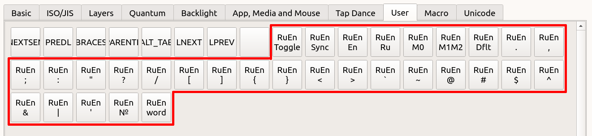

# Режим RuEn

Этот режим предназначен для того, чтобы

- расположить знаки пунктуации в одних и тех же местах для русского и английского языка,
- вводить символы из английской раскладки при печати в русской,
- переключать раскладку на английскую или русскую отдельными клавишами.

Это работает благодаря тому, что клавиатура помнит текущую раскладку, и при необходимости ввести символ, отсутствующий в русской раскладке, автоматически переключает раскладку, а после ввода символа возвращает раскладку обратно.

Основное достоинство такого подхода заключается в том, что нет необходимости устанавливать в систему дополнительное ПО или нестандартные раскладки. 

Основной недостаток — необходимость поддерживать одинаковое состояние раскладки в клавиатуре и в системе. Подробнее о том, как это обеспечить, будет рассказано ниже.

Клавиши режима RuEn можно найти в программе Vial во вкладке User. Все клавиши этого режима начинаются со слова RuEn. Чтобы воспользоваться ими, нужно добавить их к себе в раскладку (в любой удобный слой).




## Предварительные настройки

Ниже описаны несложные процедуры для предварительной настройки операционной системы и клавиатуры для работы режима RuEn. Это настройки по умолчанию, и если вы первый раз настраиваете RuEn, рекомендуется пройти по этому пути. 

Тем не менее, в некоторых случаях настройки по умолчанию могут вам не подойти:
- если у вас в системе используется нестандартное сочетание клавиш для смены раскладки, смотрите секцию [RuEn M0](#ruen-m0) и [RuEn M1M2](#ruen-m1m2);
- если вы много работаете с удаленными машинами (например, по RDP) и вам необходимо часто синхронизировать раскладку удаленной машины с раскладкой клавиатуры, смотрите секцию [RuEn M1M2](#ruen-m1m2);
- если вам необходимо иметь для каждого окна индивидуальную раскладку, или если у вас часто по какой-либо причине происходит рассинхронизация раскладки клавиатуры и системы, или же вам очень неудобно использовать клавиши `RuEn Toggle`, `RuEn En`, `RuEn Ru` для переключения раскладки, смотрите секцию [Использование программы qmk-hid-host](#использование-программы-qmk-hid-host).

Рекомендуется все же дочитать эту и следующую секцию, чтобы получить общее представление о режиме RuEn, а затем приступать к более сложной настройке.

### Windows

Особой предварительной настройки не требуется. Нужно убедиться, что
- сочетание клавиш `Win+Space` действительно переключает раскладку (для Windows 8 и новее такое должно быть по умолчанию),
- не используется индивидуальная раскладка для каждого окна.

### Linux

Нужно убедиться, что 
- сочетание клавиш `Win+Space` действительно переключает раскладку (для Ubuntu такое включено по умолчанию, для других дистрибутивов может потребоваться настройка),
- не используется индивидуальная раскладка для каждого окна.

### Mac

Нужно выполнить следующие действия:
- установить для русского раскладку Russian PC,
- выбрать способ переключения `Ctrl+Space`,
- включить на клавиатуре режим Mac (по умолчанию на месте клавиши `B` в желтом слое, она же кнопка `Toggle Ctl Gui` из вкладки Quantum программы Vial).


## Синхронизация и переключение раскладки

Чтобы клавиатура правильно переключала раскладку, нужно чтобы раскладка клавиатуры совпадала с раскладкой в системе. Для этого нужно соблюдать два правила:

1) Сначала нужно сделать так, чтобы раскладка в системе и клавиатуре совпадали; иными словами нужно синхронизировать раскладку в системе и в клавиатуре.
2) А затем, чтобы синхронизация не сбивалась, для переключения раскладки использовать **только** специальные клавиши: `RuEn Toggle`, `RuEn Ru`, `RuEn En`.

Проверить раскладку в клавиатуре можно следующими способами:

- текущую раскладку в клавиатуре можно увидеть на экране (PlanetaV2, а также K:02, K:03, Imperial44 при выбранном режиме экрана Modern или Minimalistic);
- если же экрана нет, то можно определить раскладку опытным путем: выбрать в системе английскую раскладку и нажать на клавишу `RuEn .`, если отправилась `.`, то в клавиатуре английская раскладка, а если отправилась `ю`, то в клавиатуре русская раскладка;
- можно также использовать такое соображение: при включении в клавиатуре устанавливается английская раскладка.

В случае, если раскладка в системе и в клавиатуре не совпадают, необходимо выполнить синхронизацию. Сделать это можно различными способами:
- один раз нажать на клавишу `RuEn Sync`; в этом случае клавиатура изменит внутреннее состояние, ничего не отправляя в систему;
- изменить раскладку в системе, используя стандартную комбинацию для смены раскладки;
- изменить раскладку в системе с помощью кликов мышки по значку раскладки.

После того, как вы убедились, что раскладка в клавиатуре такая же, как в системе, необходимо проверить, что клавиша `RuEn Toggle` одновременно переключает раскладку и в системе, и в клавиатуре.

Также в режиме RuEn имеется пара клавиш для переключения раскладки сразу на нужный язык: `RuEn En` и `RuEn Ru`. Клавиша `RuEn En` переключает на английскую раскладку в том случае, если в данный момент используется русская раскладка и ничего не меняет, если уже и так установлена английская раскладка. Клавиша `RuEn Ru` делает то же самое с точностью до наоборот: включает русскую раскладку, только если сейчас установлена английская.

Рекомендуется переучиться на использование клавиш `RuEn En` / `RuEn Ru` для переключения раскладки. В этом случае перед тем, как начать писать, можно сразу выставить нужную раскладку. Со временем это будет делаться автоматически, и это быстрее, чем смотреть индикатор раскладки в системе или же писать что-то, затем удалять, переключать раскладку, и набирать заново.

На этом основную настройку можно считать законченной. Далее следует справочная информация о клавишах режима RuEn и описание продвинутых режимов.

## Описание клавиш

### Клавиши переключения раскладки

#### RuEn Sync

Переключает состояние раскладки в клавиатуре, не отправляя никаких последовательностей в систему. Однократное нажатие переводит состояние из английского в русский или из русского в английский.

#### RuEn Toggle

Переключает внутреннее состояние и отправляет сочетание смены раскладки в систему.

#### RuEn En 

Для режимов [RuEn Dflt](#ruen-dflt), [RuEn M0](#ruen-m0) действует следующим образом:
- если в клавиатуре русская раскладка, то отправляет сочетание смены раскладки и меняет внутреннее состояние на английскую раскладку,
- если в клавиатуре английская раскладка, то ничего не делает.

Для режима [RuEn M1M2](#ruen-m1m2) логика работы несколько меняется:
- если в клавиатуре русская раскладка, то отправляет сочетание смены раскладки на английскую (макрос `M1`) и меняет внутренне состояние на английскую раскладку,
- если в клавиатуре английская раскладка, то отправляет сочетание смены раскладки на английскую (макрос `M1`), внутренне состояние остается на английской раскладке.

#### RuEn Ru

Для режимов [RuEn Dflt](#ruen-dflt), [RuEn M0](#ruen-m0) действует следующим образом:
- если в клавиатуре английская раскладка, то отправляет сочетание смены раскладки и меняет внутреннее состояние на русскую раскладку,
- если в клавиатуре русская раскладка, то ничего не делает.

Для режима [RuEn M1M2](#ruen-m1m2) логика работы несколько меняется:
- если в клавиатуре английская раскладка, то отправляет сочетание смены раскладки на русскую (макрос `M2`) и меняет внутренне состояние на русскую раскладку,
- если в клавиатуре русская раскладка, то отправляет сочетание смены раскладки на русскую (макрос `M2`), внутренне состояние остается на русской раскладке.


### Настройки режима переключения раскладки

#### RuEn Dflt

При нажатии этой клавиши клавиатура использует сочетание `Win+Space` для смены раскладки если не выбран режим Mac. В режиме Mac (включается сочетанием клавиш `Toggle Ctl Gui` из вкладки Quantum) клавиатура для переключения раскладки будет слать сочетание `Ctl+Space`.

Этот режим включается по умолчанию. Нажатие на клавишу `RuEn Dflt` необходимо в том случае, если ранее был включен другой режим переключения раскладки.

#### RuEn M0

Позволяет изменить способ переключения раскладки по умолчанию. Для настройки этого режима нужно выполнить следующие действия:

1) Задать в макросе `M0` необходимую последовательность для переключения раскладки. Для тестирования можно временно поместить макрос `M0` в текущую раскладку, чтобы проверить его работу.
2) Нажать на клавишу `RuEn M0`. После этого клавиатура вместо дефолтной комбинации для переключения раскладки будет отправлять макрос `M0`.

Такой способ переключения может быть полезен в разных случаях:
- переключение раскладки в системе не совпадает с дефолтным;
- имеются проблемы с дефолтным переключением: например, Windows и Ubuntu при переключении кратковременно показывает специальное окошко с выбором раскладки, которое перетягивает на несколько миллисекунд фокус на себя; опытным путем в дефолтном способе были подобраны задержки, достаточные для того, чтобы фокус этого окошка пропал; к сожалению, нет гарантий, что на вашей системе хватит этих задержек;
- либо наоборот: раздражает всплывающее окошко с раскладкой в Windows и хочется сделать так, чтобы раскладка переключалась по комбинации `Shift+Alt`.

#### RuEn M1M2

Позволяет задать отдельные макросы для переключения раскладки на английскую и русскую. Для настройки этого режима нужно выполнить следующие действия:
1) Настроить в системе комбинацию клавиш включения английской раскладки и комбинацию клавиш включения русской раскладки.
2) Задать в макросе `M1` комбинацию переключения на английскую раскладку.
3) Задать в макросе `M2` комбинацию переключения на русскую раскладку.
4) Желательно также временно поместить эти макросы на текущую раскладку и отладить их работу.
5) Нажать на клавишу `RuEn M1`. После этого клавиатура вместо дефолтной комбинации для переключения раскладки будет отправлять макрос `M1` для включения английской раскладки и макрос `M2` для включения русской раскладки.

Этот режим полезен тем, что клавиатура отправляет комбинацию смены языка независимо от того, в каком состоянии находится внутренняя раскладка. Тем самым получается, что нет необходимости синхронизировать внутреннее состояние и раскладку в системе: достаточно один раз нажать `RuEn Ru` или `RuEn En` и внутреннее состояние станет совпадать с раскладкой в системе (клавиша `RuEn Sync` в этом случае не нужна). Клавиша `RuEn Toggle` также будет работать, но присмотритесь все же к паре клавиш `RuEn Ru` и `RuEn En` (поверьте, это очень удобно, когда привыкнешь).

Этот режим также может быть особенно полезен, если приходится набирать текст на удаленных машинах, каждая из которых может иметь свою состояние раскладки.

### Символы, имеющиеся в русской и английской раскладке

При наборе этих символов не происходит переключение раскладки, т.к. они имеются и в русской и в английской раскладке:

- `RuEn .`
- `RuEn ,`
- `RuEn ;`
- `RuEn :`
- `RuEn "`
- `RuEn ?`
- `RuEn /`

### Символы из английской раскладки

При наборе этих символов из русской раскладки производится автоматическое переключение на английскую раскладку, а после ввода символа производится переключение обратно на русскую. При наборе этих символов из английской раскладки, переключения раскладки не производится.

- `RuEn [`
- `RuEn ]`
- `RuEn {`
- `RuEn }`
- `RuEn <`
- `RuEn >`
- ``RuEn ` ``
- `RuEn ~` 
- `RuEn @` 
- `RuEn #` 
- `RuEn $` 
- `RuEn ^` 
- `RuEn &` 
- `RuEn |` 

### Символ из русской раскладки

Единственный символ, который имеется в русской раскладке и отсутствует в английской:
- `RuEn №` 

Ввод этого символа работает аналогично предыдущему пункту, только временно переключает на русскую раскладку, если текущая раскладка английская.

## Дополнительные возможности

### Использование программы qmk-hid-host

Эта программа запускается на компьютере и отправляет клавиатуре различную информацию:
- текущее время,
- текущий уровень громкости,
- информацию об исполнителе и названии играющего медиа,
- текущую раскладку окна.

Программа доступна для ОС Windows и Linux, скачать ее можно по [ссылке](https://github.com/ergohaven/qmk-hid-host/releases/tag/latest). Это форк, в котором изменены настройки по умолчанию с той целью, чтобы для клавиатур Ergohaven не приходилось редактировать файл настроек. Большая благодарность автору [оригинальной программы](https://github.com/zzeneg/qmk-hid-host) zzeneg'у (он есть в нашем чате).

Для режима RuEn здесь ключевое то, что при использовании этой программы:
1) отменяется необходимость следить за синхронизацией раскладки в клавиатуре и в системе
2) появляется возможность использовать для каждого окна индивидуальную раскладку.

### Режим CAPS WORD

Режим CAPS WORD (включается при нажатии одновременно левого и правого шифтов) позволяет ввести одно слово в верхнем регистре и автоматически выйти из этого режима по нажатии на символ, разделяющий слова. В режиме RuEn поддержана режим CAPS WORD: символы, которые в английской раскладке являются разделителями слов (такие как `ЖЭХЪЁБЮ`) не прерывают режим CAPS WORD, если набираются в русской раскладке.

### Режим RuEn word

Этот режим чем-то похож на режим CAPS WORD. Он полезен при наборе в русской раскладке, т.к. предоставляет возможность ввести одно слово в английской раскладке а после ввода автоматически переключиться на русскую раскладку.

Конец слова в режиме RuEn word определяется по нажатию на Space, Enter, Escape, Minus.

Кроме того, если перед нажатием на `RuEn word` была зажата клавиша `Shift`, вместе в RuEn word также включается режим CAPS WORD.

Если вам часто приходится набирать технические или математические тексты на русском языке изобилующие английскими вставками, этот режим может стать хорошим подспорьем.

Примеры подобного текста
```md
IP-адрес, стек TCP/IP, модель OSI
имя переменной `helloWorld`
LaTeX-уравнения вида $x^2+y^2=0$
```

### Ввод Unicode-символов

*Ожидайте в следующих прошивках.*

## Дополнительные ссылки и благодарности

- спасибо всем активным пользователям [телеграм-чата Ergohaven](https://t.me/+E-mlq11c97AyZmY6), помогающим отладить и улучшить режим RuEn
- режим RuEn во многом основан на идеях [lang_shift](https://github.com/klavarog/lang_shift), автор которого также написал [интересный лонгрид о создании своей раскладки](https://optozorax.github.io/p/my-keyboard-layout/)
- спасибо автору [qmk-hid-host](https://github.com/zzeneg/qmk-hid-host) за идею и реализацию программы, позволяющую синхронизировать раскладку (и не только!) клавиатуры и операционной системы
- [Universal Layout](https://github.com/braindefender/universal-layout) — альтернативный способ решения той же проблемы ввода специальных символов с помощью создания своей раскладки, рекомендуется в том случае, если по какой-либо причине не подошел режим RuEn
